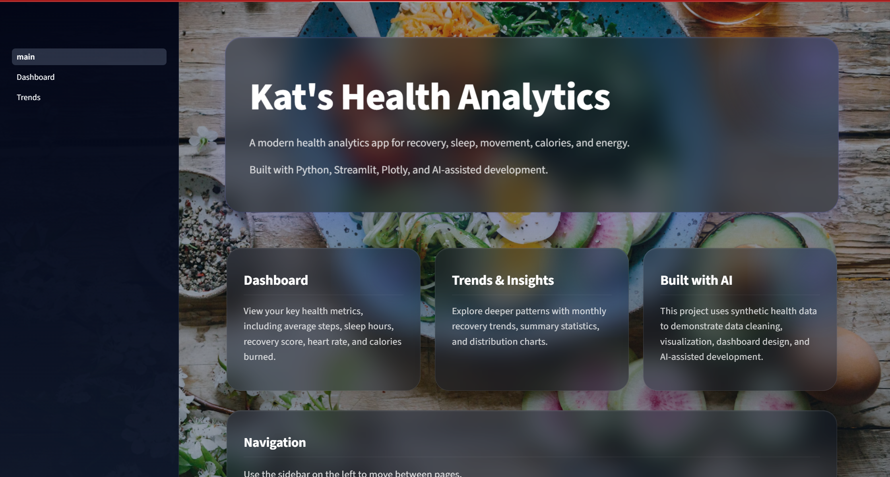
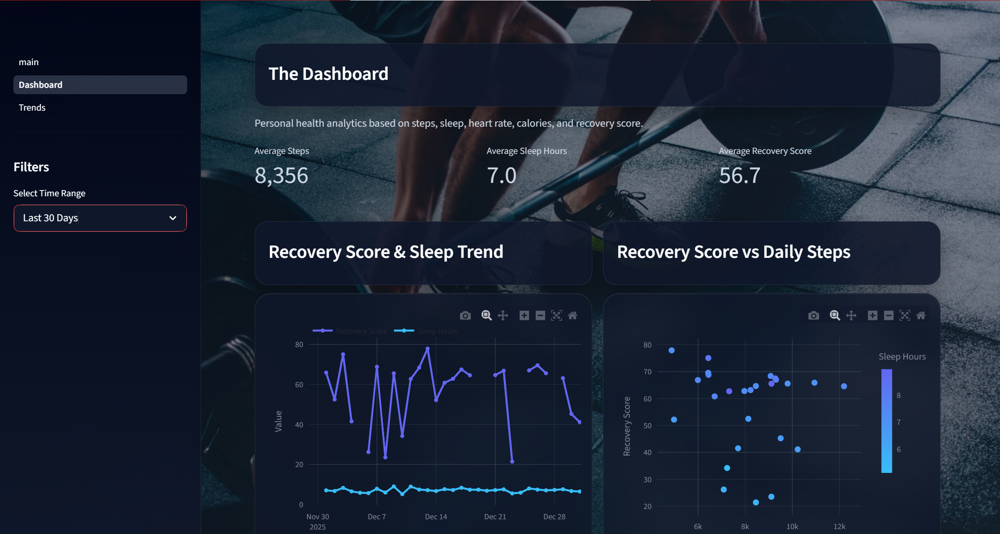
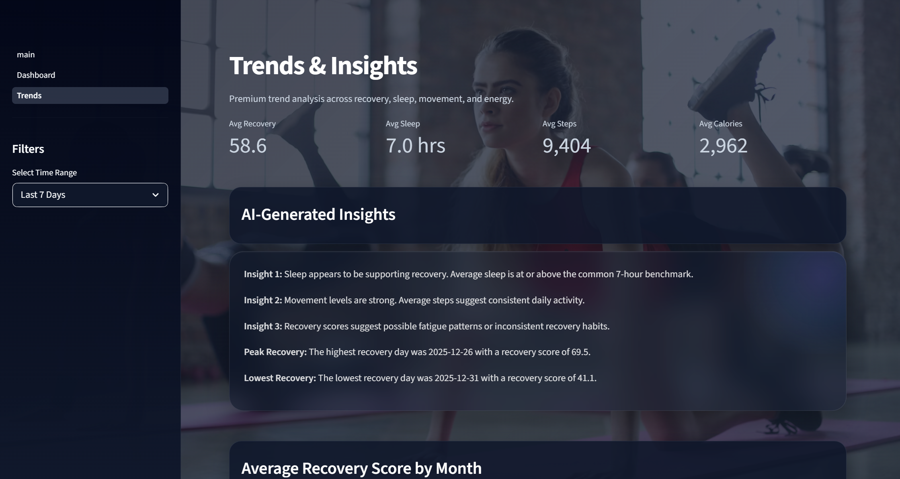

# Kat's Health Analytics


An interactive wellness analytics dashboard focused on recovery, movement, sleep, calories burned, and AI-generated health insights.

Built with Python, Streamlit, Plotly, and AI-assisted development workflows, this project analyzes synthetic wellness data through an immersive dashboard experience featuring interactive visualizations, trend analysis, and modern glassmorphism-inspired UI design.

## Live Demo


[Launch the App]https://kats-health-analytics.streamlit.app/


## Features

- Interactive Dashboard
- Trends & Insights Page
- AI-Generated Health Insights
- Dynamic Animated Backgrounds
- Modern Glassmorphism UI
- Responsive Layout
- Time-Based Filtering
- Recovery Trend Analysis
- Interactive Plotly Visualizations
- Streamlit Caching for Performance

---

## Tech Stack

- Python
- Streamlit
- Plotly
- Pandas
- CSS / Glassmorphism UI
- AI-Assisted Development
- Plotly Express
- Responsive CSS Styling

---

## Screenshots

### Main Page


### Dashboard


### Trends & Insights


---

## Project Structure

```text
kats-health-analytics/
│
├── main.py
├── pages/
│   ├── 1_Dashboard.py
│   └── 2_Trends.py
│
├── modules/
│   └── processor.py
│
├── styles/
│   └── theme.py
│
├── utils/
│   ├── constants.py
│   └── chart_helpers.py
│
├── images/
├── requirements.txt
└── README.md
```
## Project Goals

This project was designed to demonstrate:

- Data visualization
- Dashboard design
- User experience thinking
- AI-assisted development workflows
- Data storytelling
- Trend analysis
- Front-end polish in Python applications

---

## AI-Assisted Development

This project was developed using an AI-assisted iterative workflow that combined Python development, UI refinement, debugging, and rapid prototyping.
- UI iteration
- Debugging
- Chart design
- Layout optimization
- Feature ideation
- Styling refinement

The goal was not just to build a dashboard, but to learn modern iterative development practices using AI tools alongside Python development.

---

## Installation

```bash
git clone https://github.com/1SharpKat/kats-health-analytics.git
cd kats-health-analytics
pip install -r requirements.txt
streamlit run main.py
```

## Key Skills Demonstrated

- Python application development
- Interactive dashboard design
- Streamlit development
- Data visualization with Plotly
- AI-assisted iterative development
- UX/UI refinement
- Front-end styling within Python applications
- Data storytelling
- Debugging and troubleshooting
- Modular project organization

---

## Future Improvements


- Real wearable integrations
- Predictive recovery scoring
- Personalized recommendations
- Advanced anomaly detection
- Exportable reports
- Authentication & user profiles

These future enhancements would expand the dashboard from a visualization project into a more production-oriented wellness analytics platform.

---

## Challenges & Learnings

One of the biggest challenges during development was balancing advanced visual styling with Streamlit’s rendering limitations. Building reusable glassmorphism styling, integrating animated backgrounds, debugging deployment issues, and maintaining chart readability over dynamic wallpapers required multiple rounds of iteration and refinement.

This project strengthened my confidence working through real-world debugging scenarios while also improving my understanding of modern AI-assisted development workflows.

## Author

Kathryn “Kat” Sharp
